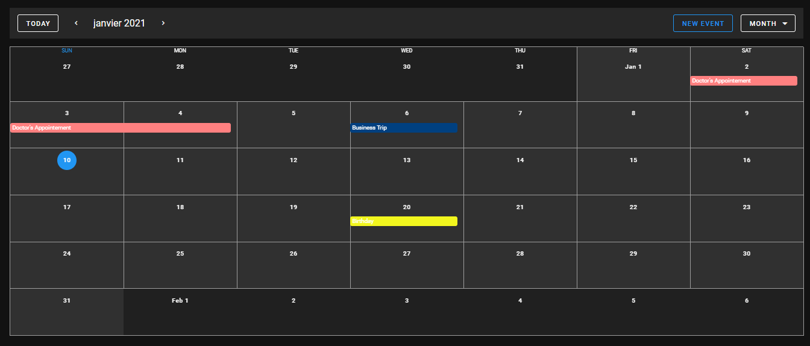

# Vue-Calendar


## Description:
This is my second challenge (One week challenge), In this project I hooked up a Firebase Firestore to a custom Vue.js application using the [Vuetify Calendar component](https://vuetifyjs.com/en/components/calendars/).

## ScreenShots:



## Challenges:
* [Day 1: Jet-Spectre](https://github.com/Abir-Bouhriz/Spectre-Clone)
* [Day 2: Vue-Calendar](https://github.com/Abir-Bouhriz/Vue-Calender)
* [Day 3: Jet-Login-Form](https://github.com/Abir-Bouhriz/Jet-Login-Form)

## Tools & languages:
* Vue.js (front end JavaScript framework)
* Vuetify (Material Design component framework)
* HTML
* CSS
* JavaScript
* Visual Studio Code ( Text editor )

## Project setup
```
npm install
```

### Compiles and hot-reloads for development
```
npm run serve
```

### Compiles and minifies for production
```
npm run build
```

### Lints and fixes files
```
npm run lint
```

### Customize configuration
See [Configuration Reference](https://cli.vuejs.org/config/).

## Contribution:
Feel free to fork this project and add whatever you like. If you have any suggestions or any comments please feel free to contact me or to open an issue.

## Special thanks:
[Traversy Media Tutorial](https://www.youtube.com/watch?v=2NOsjTT1b_k&t=214s).

## Team:
[Jetlighters](https://github.com/JetLightStudio) having fun.

